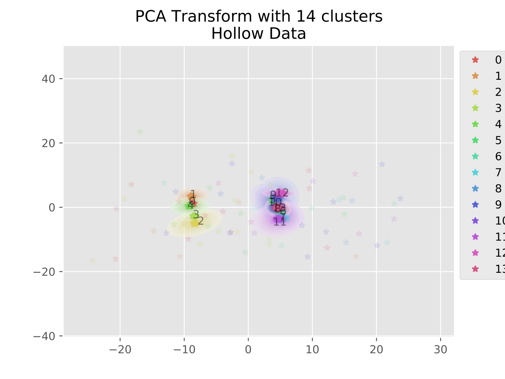

This is an example script demonstrating usage of the parametric tSNE method.
First, training data is generated for 14 clusters in 14 dimensions. We use 2000 training points and 2000 testing points.
The clusters are well-separated for simplicity. Clusters 0-4 are in a common 5-D space, clusters 5-13 are in a separate 9-D space. Think a block diagonal matrix.
The model is saved in h5 format using Keras.
The results for a 2-D tSNE are visualized below for several perplexity values, multiscale, as well as 2-component PCA for comparison.
The training data is plotted as contours, the test data as individual points.
Each cluster has 2000/14 = 142 points, so perplexity = 100 is closest to "correct".

")

")

")

In general it seems the multiscale separates 0-4 from 5-13 best while also preserving the separation between clusters 0-4. However, the boundary between 0-4 and 5-13 is not entirely obvious and much more subtle than with higher perplexity.

## Requirements 
matplotlib  
seaborn  
scikit-learn (PCA only)  
