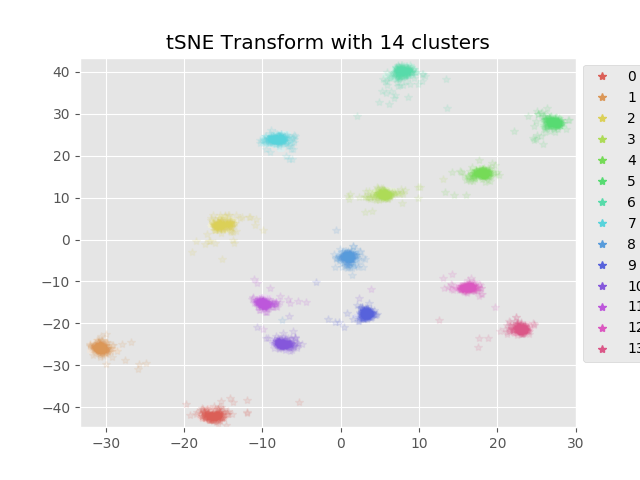
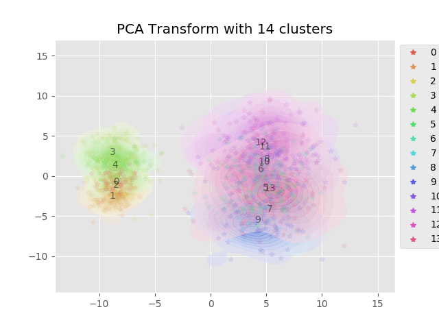

This is an example script demonstrating usage of the parametric tSNE method.
First, training data is generated for 14 clusters in 14 dimensions. We use 2000 training points and 2000 testing points.
The clusters are well-separated for simplicity. The model is saved in h5 format using Keras.
The results for a 2-D tSNE are visualized below, as well as 2-component PCA for comparison. 
The training data is plotted as contours, the test data as individual points.

##Requirements
matplotlib  
seaborn  
scikit-learn (PCA only)
